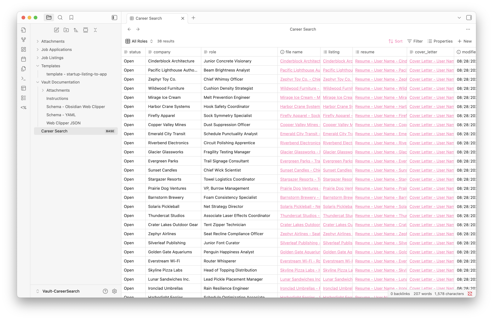
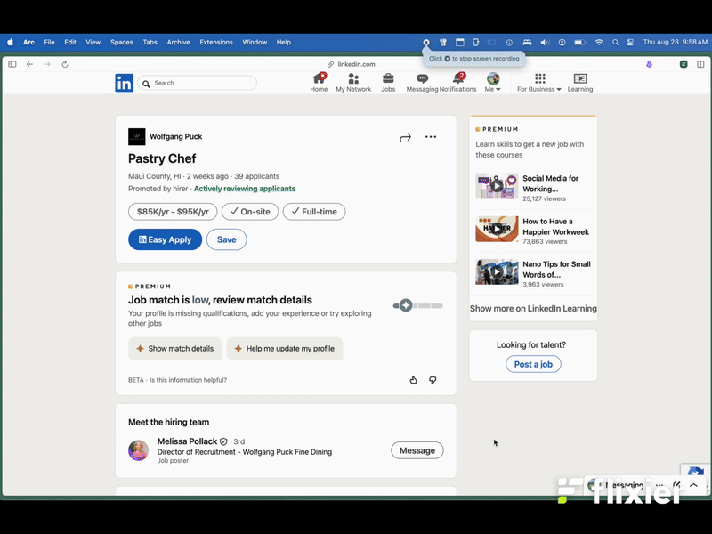

# Job Tracker for Obsidian

This template vault streamlines your job search by combining Obsidian’s Web Clipper and Templater plugins. Clip LinkedIn job listings directly into your vault, automatically generate application records, and track key details and documents in one place.

## Requirements
- [Obsidian](https://obsidian.md/) (v1.9.10+ recommended)  
  > Bases is included as a core plugin starting with this version.  
- Community plugins:  
  - [Obsidian Web Clipper](https://obsidian.md/clipper) ([GitHub](https://github.com/obsidianmd/obsidian-clipper))  
  - [Templater](https://github.com/SilentVoid13/Templater)

## How to Install
1. Download or clone this repo.  
2. Open the `Vault-CareerSearch/` folder as a vault in Obsidian.  

## How to Use
1. Import the provided JSON file (in *Vault-CareerSearch/Vault Documentation*) into Obsidian Web Clipper.  
2. Use Web Clipper to capture a LinkedIn job listing → this creates a new `(Listing)` note.  
3. Upon creation of a `(Listing)` note, a corresponding `(App)` note will be generated automatically.  

> Tip: Update the **Resume** and **Cover Letter** fields in the `(App)` note’s YAML. These must follow the syntax defined in the `template - startup-listing-to-app` JavaScript template.

## Folder Overview
Inside `Vault-CareerSearch/` you’ll find:
- **Job Applications** – notes created from clipped listings.  
- **Job Listings** – raw or example job listing captures.  
- **Templates** – includes templater scripts and YAML templates.  
- **Vault Documentation** – schemas, setup notes, and the Web Clipper JSON.  
- **Attachments** – images or supporting files referenced in notes.  

## Demo

## License
This vault is licensed under the [Creative Commons Attribution 4.0 International License (CC BY 4.0)](https://creativecommons.org/licenses/by/4.0/).

> Note: This license applies only to the vault structure and documentation. Obsidian and its plugins (e.g., Web Clipper, Templater) are licensed separately by their respective authors.

## Credits
Created by [Matt Gordon](https://github.com/matthewjgordon). Please attribute if reusing or adapting.

### Attribution Example
If you use or adapt this vault, please credit as:  
> “Job Tracker for Obsidian by Matt Gordon — https://github.com/matthewjgordon/Obsidian-Vault-Job-Tracker (CC-BY 4.0)”